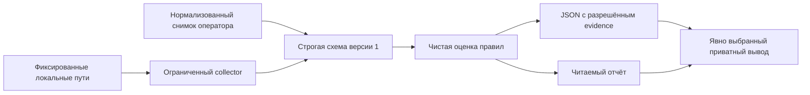

# Архитектура

`schema.py` определяет входную схему и валидатор именно её словаря, а не универсальный
движок JSON Schema. Экспорт Draft 2020-12 задаёт структуру; runtime дополнительно
отвергает повторные ключи, невозможные даты, непустые unavailable/not_run и превышение
размера. `collector.py` читает фиксированные пути; альтернативный root нужен для
синтетических тестов. `rules.py` не обращается к хосту; `cli.py` управляет выбором,
exit codes и приватной записью. Runtime и тесты используют стандартную библиотеку.

## Контракт наблюдения

Наблюдение: state observed/unavailable/not_run, source synthetic/operator/static/runtime
и закрытый набор типизированных values. Отсутствующее поле — недостаток данных,
не безопасное значение по умолчанию. source сообщает поставщик: это не подлинность
и не аттестация. Не принимаются имена хостов/пользователей, сырая конфигурация, пути
и произвольный текст. SHA256 baseline допустим для drift, но в отчёте остаётся только равенство.

Профили платформ задают применимость кандидатов, а не проверенную поддержку. Collector
сводит RHEL minor к major; точные minor/kernel записываются приватно в лаборатории.
Клоны — other. Неизвестные версии и aarch64 дают unknown. Свежесть CLI — 24 ч;
будущее более 5 мин даёт unknown. Доверие к часам внешнее.

## Семантика оценки

Всегда 12 findings в стабильном порядке. Unselected/not_run имеют пустое evidence.
Неподдерживаемые, устаревшие и недоступные данные дают unknown до оценки политики.
Известный небезопасный факт может дать fail при неполноте; pass требует всех полей
и предпосылок правила. Статические SSH-флаги — риск для ревью, не доказательство
эффективной конфигурации sshd. Безопасные static-факты не дают pass для SSH,
LSM/systemd/logs/kernel/containers. operator/synthetic pass зависит от истинности
утверждения. Ни одна группа не является полной проверкой compliance или безопасности.

complete означает отсутствие unknown/not_run, а не отсутствие fail. Exit 0 при
пороговом режиме по умолчанию может содержать unknown. `--fail-on incomplete` нужен,
если pipeline требует полноты evidence. Не выбранные проверки намеренно сохраняют
неполноту, чтобы скрытое сокращение объёма не выглядело полной проверкой.

## Файловый ввод-вывод

Root и каждый каталог открываются без symlink. O_PATH позволяет проверить регулярный
файл до открытия на чтение; повторное чтение привязано к собственному procfs fd.
Метаданные получаются через fstat без содержимого. Каталог вывода должен принадлежать
эффективному UID и не иметь group/world bits. Новый файл: O_EXCL, O_NOFOLLOW, 0600.
Ошибка записи удаляет только созданный файл через тот же fd каталога. CLI не создаёт
каталоги и не выполняет chmod; приватный каталог выбирает оператор. Возможны atime/журналы.

Нет daemon, БД, shell executor, package mutations, plugins политик, remote uploads
или SSH transport. Размер входа ограничен, но I/O ядра/сетевой ФС может зависнуть;
бюджеты памяти и времени на реальном хосте ещё не измерены.
