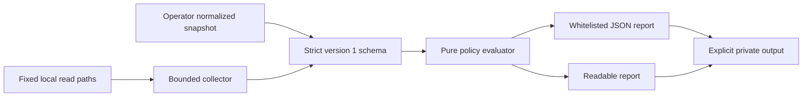

# Architecture

`schema.py` defines the input schema and a restricted validator for exactly its
vocabulary. Exported Draft 2020-12 JSON Schema describes structural types; the
runtime additionally rejects duplicate keys, impossible calendar dates, nonempty
unavailable/not_run values and oversized files. It is not a generic JSON Schema engine.
`collector.py` reads fixed paths only, accepts an alternate synthetic root for tests,
and never invokes commands. `rules.py` is pure; `cli.py` handles selection, exit codes
and create-only output. Runtime and tests require only Python's standard library.

## Observation contract

An observation has `state` observed/unavailable/not_run, `source`
synthetic/operator/static/runtime and a closed set of typed `values`. Fields are
optional: omission is missing evidence, not a default safe value. `source` is a claim
made by the input producer, not authenticated provenance. No host identity, raw
configuration, usernames, paths or arbitrary text are accepted. SHA256 baseline
facts are accepted only for drift and replaced by equality in the report.

Platform profiles are candidate rule applicability only, never validated support.
RHEL major profile normalizes a collector's minor version; detailed release and
kernel provenance belong in private laboratory records. Clones are `other`.
Aarch64/unknown versions yield unknown. Fact freshness is fixed at 24 h in CLI;
future timestamps over 5 min are unknown. Clock trust is external.

## Evaluation semantics

Always emit 12 findings in stable order. Unselected/not_run groups have empty
evidence. Unsupported/stale/unavailable groups are unknown before policy evaluation.
Known unsafe facts can fail even when completeness is absent; a pass requires every
rule-specific fact and prerequisite. Static SSH values are fragment observations:
explicit enabling flags are risks for review, not proof of effective sshd state.
For runtime-oriented groups, static safe facts cannot grant pass. An operator or
synthetic pass is conditional on the truth/completeness of that asserted snapshot.
No group is a full compliance standard or host safety certification.

`complete` means no unknown/not_run findings; it does not mean safe. Exit 0 with the
default threshold can still contain unknown. `--fail-on incomplete` is recommended
when a pipeline needs complete selected policy evidence. Excluded checks still count
as incomplete deliberately: selection must not disguise reduced scope.

## Local I/O

Open root and each directory without following symlinks. O_PATH descriptors allow
validation of regular files before opening for data reads; reopening the anchored
file uses the process's own procfs fd path. Metadata uses fstat, not file content.
Output parents must be owned by the effective UID and have no group/world bits;
creation is O_EXCL, O_NOFOLLOW, 0600. A failed write removes only the file it created
using the same directory fd. No directory creation or chmod is performed by the CLI.
The caller chooses a private output directory. Read atime/audit logs may change.

No persistent daemon, database, shell executor, package-manager mutations, policy
plugins, transport or remote uploads. Memory/elapsed budgets remain unbenchmarked;
input size is bounded but kernel/network filesystem I/O can stall.
